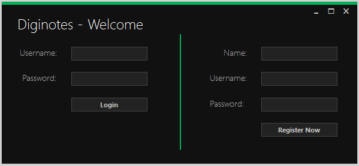
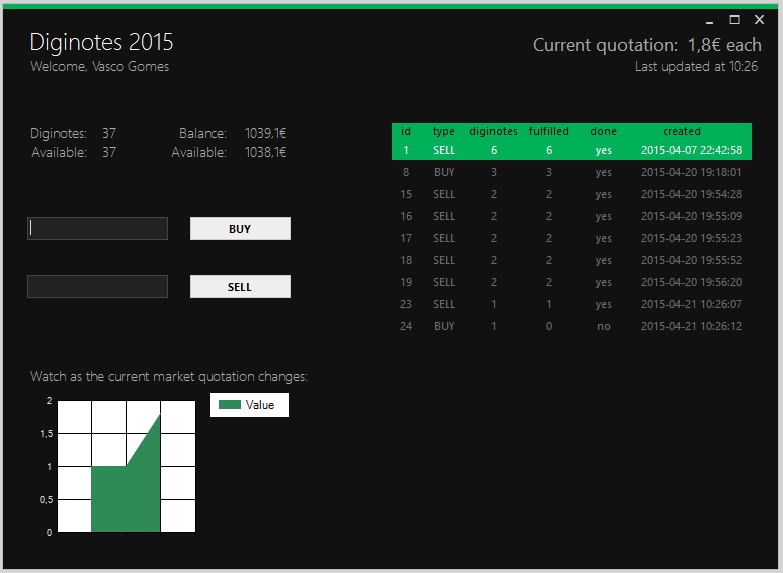

# Diginotes

Developed for the class of Distribution and Integration Technologies (EIC0077) at MIEIC, FEUP. 

> The main objective of this project is the development of an exchange system of digital assets known as *diginotes*, based on .NET Remoting. Each *diginote* is represented by an object with an unique serial number and value. All *diginotes* are previously registered in the system along with their current owner. The *diginotes* switch ownership via digital transactions at the market's current quotation. 

> The application here presented was structured into three individual modules, or projects: [1] server, central module, responsible for all operations and their respective execution; [2] client, represents the access point for a regular user; [3] shared, an intermediate module containing elements and definitions common to the other modules.

Further info can be found in the [full report](Docs/report.pdf) (Portuguese).

## Screenshots

## Usage Instructions

The server module (*Server.exe*) should be initiated before any client. Afterwards, users may open multiple instances of the client module (*Client.exe*).

As seen above, the *Diginotes* field at the left refers to the total amount of *diginotes* currently owned by the user. The *Available* field refers to the amount of *diginotes* the user may move. For instance, once the user issues a sell order, the amount of *diginotes* available is decreased so as to account for the amount reserved for the transaction.
